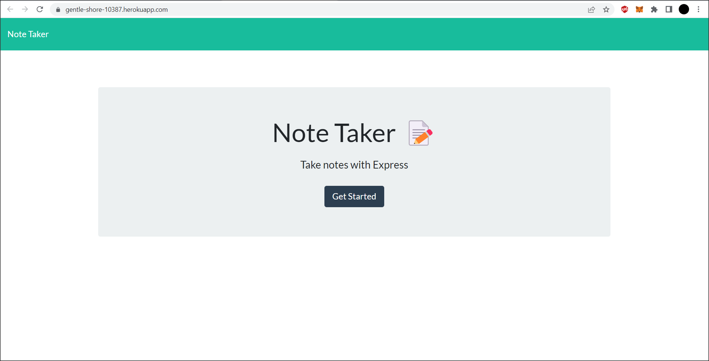
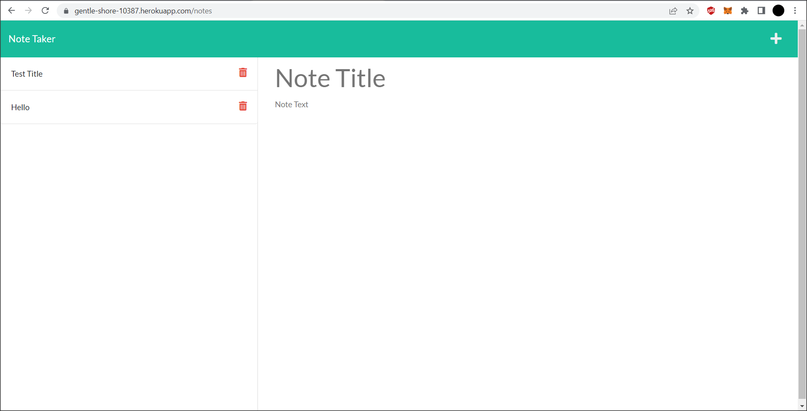

# Note Taker

This application is a note taker that merges front-end and back-end tech to allow for the creation and selection of notes. These notes are then saved to a .json file to be stored. There are only two pages in this application, the main page and the notes page.

 

 
 
